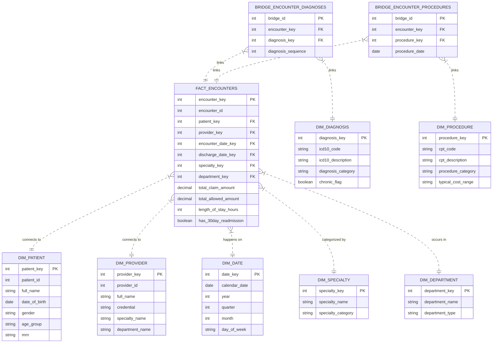
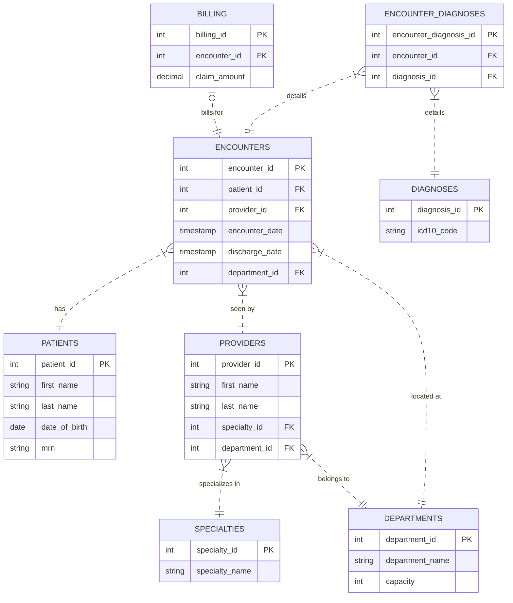
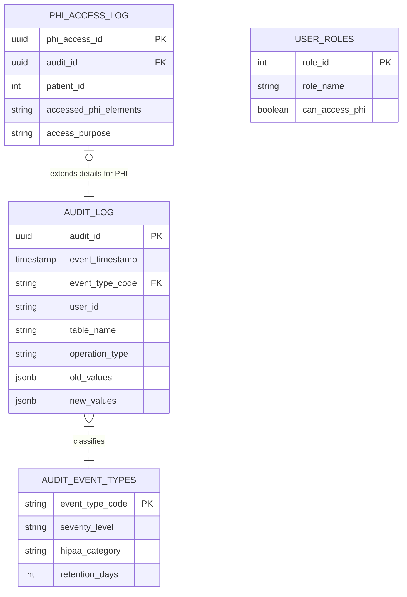

# Healthcare Analytics Project - Entity Relationship Diagrams (ERD)

This document contains appropriate entity relationship diagrams for the three main schemas in the project.

## 1. Star Schema (Analytics Data Warehouse)

This schema follows a dimensional modeling approach with a central fact table and surrounding dimensions. Note the Bridge tables handling many-to-many relationships.

 

## 2. OLTP Schema (Source System)

This schema represents the highly normalized transactional database (Hospital DB).

 

## 3. Audit Framework (Compliance & Logging)

This schema manages HIPAA compliance logging and ETL operational monitoring.

